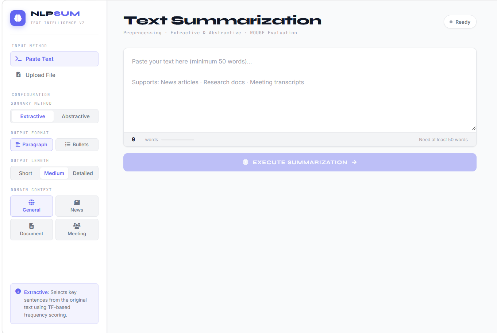

# 📝 NLP Text Summarization System

> An end-to-end NLP web application that generates concise summaries from long documents using Extractive and Abstractive techniques.


---

## 📸 Demo



---

## 📌 Features

| Feature | Description |
|---|---|
| ✅ Extractive Summarization | Selects key sentences using TF-based frequency scoring |
| ✅ Abstractive Summarization | Generates new sentences using DistilBART transformer |
| ✅ Bullet Points Format | Clean bullet-point output |
| ✅ ROUGE Evaluation | ROUGE-1, ROUGE-2, ROUGE-L metrics |
| ✅ Preprocessing Pipeline | Tokenization, cleaning, stop-word removal |
| ✅ File Upload | PDF, DOCX, TXT support |
| ✅ Download Summary | Export as TXT or PDF |
| ✅ Domain Context | General, News, Document, Meeting |
| ✅ Modern UI | Clean light theme with real-time feedback |

---

## 🛠️ Tech Stack

| Layer | Technology |
|---|---|
| Backend | Python, Flask |
| NLP | NLTK, Transformers (DistilBART) |
| Evaluation | ROUGE Score |
| File Processing | PyPDF2, python-docx |
| Frontend | HTML, CSS, JavaScript |
| Export | FPDF |

---

## 📁 Project Structure
```
Text-Summarization/
│
├── app.py                  # Flask app and API routes
├── requirements.txt        # Python dependencies
├── README.md
│
├── utils/
│   ├── __init__.py
│   ├── summarizer.py       # Extractive & Abstractive logic
│   └── text_processing.py  # Preprocessing pipeline
│
├── static/
│   ├── style.css
│   └── script.js
│
└── templates/
    └── index.html
```

---

## ⚙️ Installation & Setup

### 1. Clone the repository
```bash
git clone https://github.com/Purushothamreddy6749/Text-Summarization.git
cd Text-Summarization
```

### 2. Create and activate virtual environment
```bash
# Create
python -m venv venv

# Windows
venv\Scripts\activate

# Mac/Linux
source venv/bin/activate
```

### 3. Install dependencies
```bash
pip install -r requirements.txt
```

### 4. Download NLTK data
```bash
python -c "import nltk; nltk.download('punkt'); nltk.download('stopwords'); nltk.download('punkt_tab')"
```

### 5. Run the application
```bash
python app.py
```

### 6. Open in browser
```
http://127.0.0.1:5000
```

---

## 📊 How It Works
```
Input Text
    │
    ▼
┌─────────────────────────┐
│   Preprocessing Pipeline │
│  • Text Cleaning         │
│  • Sentence Tokenization │
│  • Word Tokenization     │
│  • Stop-word Removal     │
│  • Vocabulary Analysis   │
└─────────────────────────┘
    │
    ▼
┌─────────────────────────┐
│     Summarization        │
│  • Extractive → TF Score │
│  • Abstractive → BART    │
└─────────────────────────┘
    │
    ▼
┌─────────────────────────┐
│   ROUGE Evaluation       │
│  • ROUGE-1 (Content)     │
│  • ROUGE-2 (Fluency)     │
│  • ROUGE-L (Structure)   │
└─────────────────────────┘
    │
    ▼
Output (Paragraph / Bullet Points)
```

---

## 📈 ROUGE Metrics Explained

| Metric | Measures | Description |
|---|---|---|
| ROUGE-1 | Unigram overlap | Content coverage |
| ROUGE-2 | Bigram overlap | Fluency |
| ROUGE-L | Longest common subsequence | Structural accuracy |

---

## 👤 Author

**R. Purushotham Reddy**
[](https://www.linkedin.com/in/r-purushotham-reddy-97637b32b)
[](https://github.com/Purushothamreddy6749)
[](mailto:r.purushothamreddy20112003@gmail.com)

---

## 📄 License

This project is licensed under the [MIT License](LICENSE).
